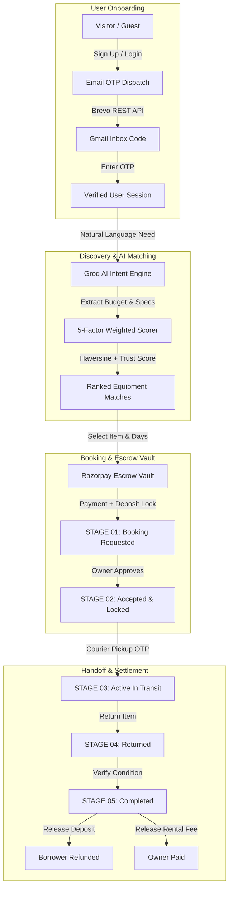
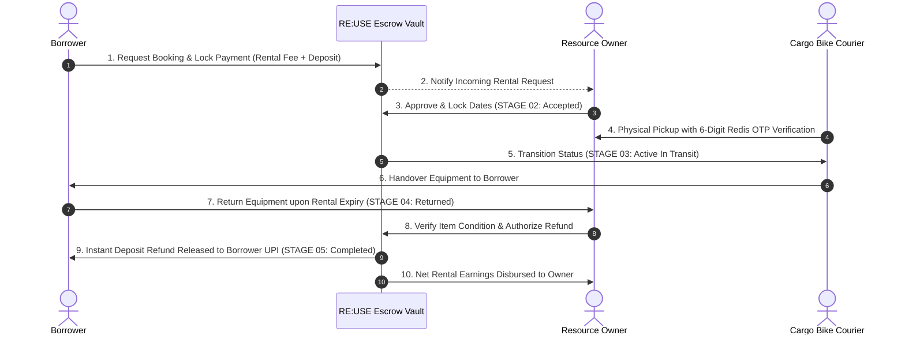
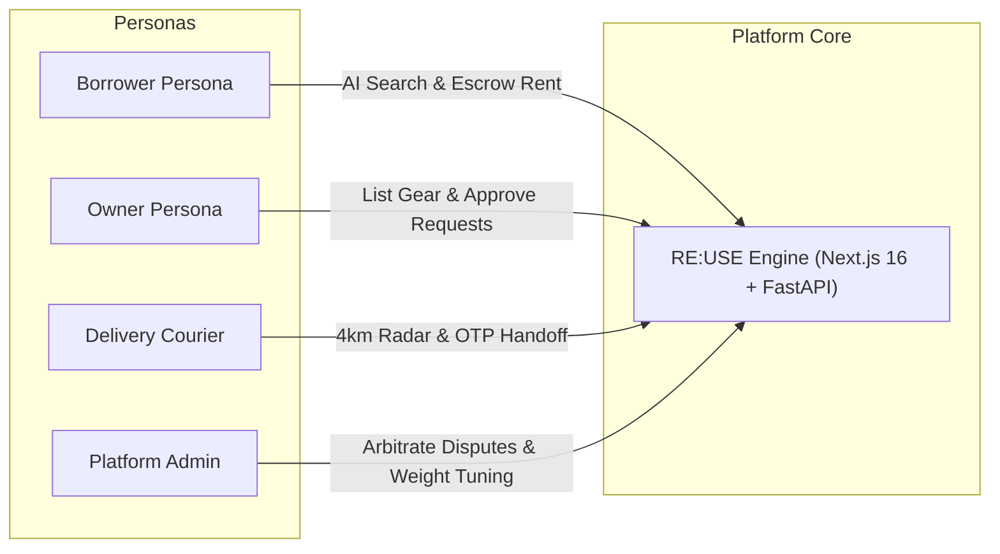

# 🌐 RE:USE — Hyperlocal Peer-to-Peer Equipment Sharing Marketplace

> **"Don't buy more. Share what already exists."**  
> RE:USE is a full-stack, hyperlocal peer-to-peer equipment sharing ecosystem powered by AI intent matching, 5-factor spatial scoring, real-time OTP authentication, single-use custody handoffs, and smart escrow vault payments.

---

## 🚀 Live Deployments & Quick Links

| Service / Platform | Live URL | Description & Status |
|-------------------|----------|----------------------|
| 🌐 **Frontend Web App** | [https://reuseproject-eight.vercel.app](https://reuseproject-eight.vercel.app) | Production Next.js 16 App deployed on Vercel 🟢 |
| ⚡ **FastAPI Backend Gateway** | [https://reuse-backend-cbc3.onrender.com](https://reuse-backend-cbc3.onrender.com) | Python Async FastAPI Backend deployed on Render 🟢 |
| 📖 **Interactive API Docs** | [https://reuse-backend-cbc3.onrender.com/docs](https://reuse-backend-cbc3.onrender.com/docs) | Swagger / OpenAPI 3.0 Interactive Documentation 🟢 |
| 🩺 **Backend Health Endpoint** | [https://reuse-backend-cbc3.onrender.com/health](https://reuse-backend-cbc3.onrender.com/health) | Live System & Service Health Endpoint 🟢 |
| 💻 **GitHub Repository** | [https://github.com/khaleek696-art/reuseproject](https://github.com/khaleek696-art/reuseproject) | Official Source Code Repository 🟢 |

---

## 📊 Workflow & Architecture Diagrams

### 1️⃣ End-to-End System Workflow Diagram



---

### 2️⃣ 5-Stage Custody & Escrow Vault Lifecycle



---

### 3️⃣ Multi-Role Ecosystem Architecture



---

## 🌟 Key Highlights & Modules

- 🎯 **4 Isolated User Personas**: Role-based access control (RBAC) enforcing distinct interfaces for **Borrowers**, **Resource Owners**, **Delivery Partners**, and **Platform Administrators**.
- 🤖 **AI Smart Intent Engine (Groq Llama-3.3 Integration)**: Natural language equipment search with automated budget, technical specs, and date extraction.
- 📐 **5-Factor Mathematical Match Engine**: Spatial PostGIS/Haversine distance, time overlap percentage, budget fit, feature compatibility, and PeerTrust credibility score.
- 🔐 **Verified Escrow Vault**: Refundable security deposit holds and automated release upon verified return via Razorpay integration.
- 📧 **Production-Grade Email OTP System**: Multi-engine email dispatch (Brevo REST API + SendGrid + Google SMTP fallback) for real 6-digit email OTPs.
- 🚲 **Hyperlocal Cargo Bike Courier Console**: 6-digit single-use OTP handoff verification for fraud-free physical exchanges within a 4 km radius.
- 🛡️ **PeerTrust Credibility Scoring**: Weighted mathematical trust algorithm factoring volume, rater credibility, on-time returns, and zero-dispute records.
- 📊 **Dynamic Live Bookings Synchronization**: Instant bidirectional sync between Borrower rentals and Owner incoming request consoles.

---

## 🏗️ Role-Based System Architecture

| Role | Target Persona | Core Capabilities | Access Boundaries |
|------|----------------|-------------------|-------------------|
| **Borrower** | Campus Students & Seekers | Catalog search, AI intent matches, rent gear, Escrow payment, OTP receive, contract inspection, leave reviews | Cannot list items, cannot access admin console |
| **Resource Owner** | Equipment Owners & Lenders | Gear listing modal, daily rate & deposit holds, approve/reject requests, verify returns & release refunds | Cannot borrow own items, cannot access courier console |
| **Delivery Partner** | Cargo Bike Couriers | Dispatch radar (within 4km), accept pickup jobs, 6-digit OTP custody verification, earn delivery fees | Cannot access admin console or edit listings |
| **Platform Administrator** | Superusers / Admins | Platform KPIs, dispute arbitration, escrow hold overrides, 5-factor algorithm weight tuning | Cannot personally list or borrow gear |

---

## 🛠️ Complete Tech Stack

### Frontend Architecture
- **Framework**: Next.js 16 (App Router, Webpack)
- **Language**: TypeScript (Strict Type Checking)
- **Styling**: Tailwind CSS, Lucide React Icons
- **State Management**: React Context (`RoleContext`) with client-side `localStorage` persistence
- **Geospatial Radar**: Leaflet / React-Leaflet Map Engine
- **Live Deployment**: Vercel (`https://reuseproject-eight.vercel.app`)

### Backend Architecture
- **API Framework**: FastAPI (Python 3.11+)
- **Server**: Uvicorn ASGI Server (`http://localhost:8000`)
- **Database**: SQLite / PostgreSQL with PostGIS Spatial Extensions
- **AI Brain**: Groq API (`groq/llama-3.3-70b-versatile`, fallback to `qwen/qwen3.8-27b`)
- **Email Infrastructure**: Brevo (Sendinblue) REST API over Port 443 HTTPS with Twilio SendGrid & Google SMTP fallback
- **Storage**: AWS S3 Bucket (`reuse-app-storage`) with Base64 Data URL fallback
- **Live Deployment**: Render (`https://reuse-backend-cbc3.onrender.com`)

---

## 🚀 Getting Started

### Prerequisites
- Node.js 18+ & npm
- Python 3.10+ & `pip` / `venv`

---

### 1️⃣ Backend Setup (FastAPI)

```bash
# Navigate to backend directory
cd backend

# Create & activate Python virtual environment
python3 -m venv venv
source venv/bin/activate

# Install dependencies
pip install -r requirements.txt

# Copy environment variable template & set your keys
cp .env.example .env

# Run FastAPI backend server
uvicorn app.main:app --reload --port 8000
```

> 🌐 Backend API Gateway will launch at `http://localhost:8000` with interactive Swagger docs at `http://localhost:8000/docs`.

---

### 2️⃣ Frontend Setup (Next.js)

```bash
# Navigate to project root
cd ..

# Install dependencies
npm install

# Run Next.js development server
npm run dev
```

> 💻 Open `http://localhost:3000` in your browser. Look for the **`🟢 FastAPI Live`** badge in the navigation header to confirm backend integration!

---

## 🔐 Environment Variables Configuration

Configure your `.env` (backend) credentials:

```ini
# FastAPI Settings
PROJECT_NAME="RE:USE Hyperlocal Circular Marketplace"
ENVIRONMENT="development"

# Brevo (Sendinblue) REST Email API Key
BREVO_API_KEY=your_brevo_api_key_here

# Groq AI Key
GROQ_API_KEY=your_groq_api_key_here

# Mail SMTP Credentials (Fallback)
MAIL_USERNAME=reuse.marketplace.help@gmail.com
MAIL_PASSWORD=your_app_password_here
```

---

## 🧪 Production Build & Verification

To verify clean TypeScript compilation and build output across all 17 routes:

```bash
npm run build
```

---

## 📄 License & Attribution

Crafted for sustainable campus communities and circular economy initiatives. Built with ❤️ for zero single-use waste.
